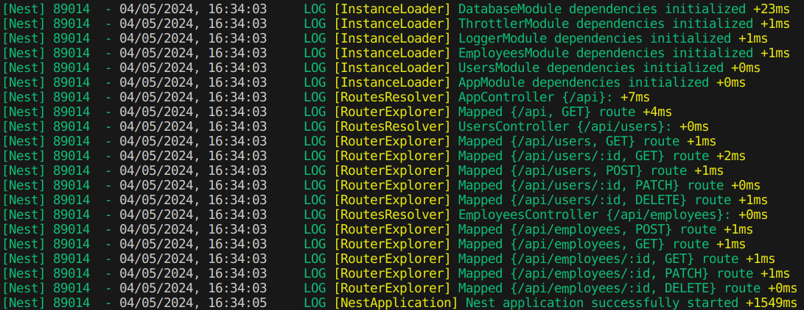

# Employee CRUD

> ⭐️ Projeto de estudo desenvolvido através do curso "Nest.js Full Course for Beginners" de Dave Gray: https://www.youtube.com/watch?v=8_X0nSrzrCw

> ⭐️ Study project developed through Dave Gray's course "Nest.js Full Course for Beginners": https://www.youtube.com/watch?v=8_X0nSrzrCw

## 🇧🇷 pt-br

### Descrição

_TL;DR:_ Desenvolvimento de API REST utilizando `NestJS` e banco de dados `Serverless Postgres` (`Neon` + `Prisma ORM`).

Este é um projeto que implementa uma `API CRUD` para gerenciamento de funcionários. O projeto utiliza `Node.js`, `TypeScript`, `Express`, `NestJS`, `Jest` para testes, `Neon` para o `Banco de Dados Postgres Serverless` e `Prisma` como o ORM.

### Sobre os recursos

- [Nest](https://github.com/nestjs/nest) é um framework Node.js progressivo para construir aplicações eficientes;
- [Neon](https://neon.tech/) oferece um serviço Postgres serverless para soluções de banco de dados escaláveis;
- [Prisma](https://www.prisma.io/) é uma ferramenta ORM para consultas e migrações de banco de dados fáceis.

### Como executar

1. Clone o repositório;
2. Instale as dependências com `npm install`;
3. Crie um arquivo `.env` utilizando o exemplo de `.env.example`;
4. Execute as migrações do ORM do Prisma com `npx prisma migrate dev`;
5. Inicie o servidor com `npm run start:dev`.

## 🇺🇸 en-us

## Description

_TL;DR:_ REST API Development using `NestJS` and `Serverless Postgres` DB (`Neon` + `Prisma ORM`).

This is a project that implements a `CRUD API` for employee management. The project uses `Node.js`, `TypeScript`, `Express`, `NestJS`, `Jest` for testing, `Neon` for the `Postgres Serverless Database`, and `Prisma` as the ORM.

## About the resources

- [Nest](https://github.com/nestjs/nest) is a progressive Node.js framework for building efficient applications;
- [Neon](https://neon.tech/) provides a serverless Postgres service for scalable database solutions;
- [Prisma](https://www.prisma.io/) is an ORM tool for easy database queries and migrations.

## How to run

1. Clone the repository;
2. Install the dependencies with `npm install`;
3. Create a `.env` file using the example of `.env.example`;
4. Run the Prisma's ORM migrations with `npx prisma migrate dev`;
5. Start the server with `npm run start:dev`
